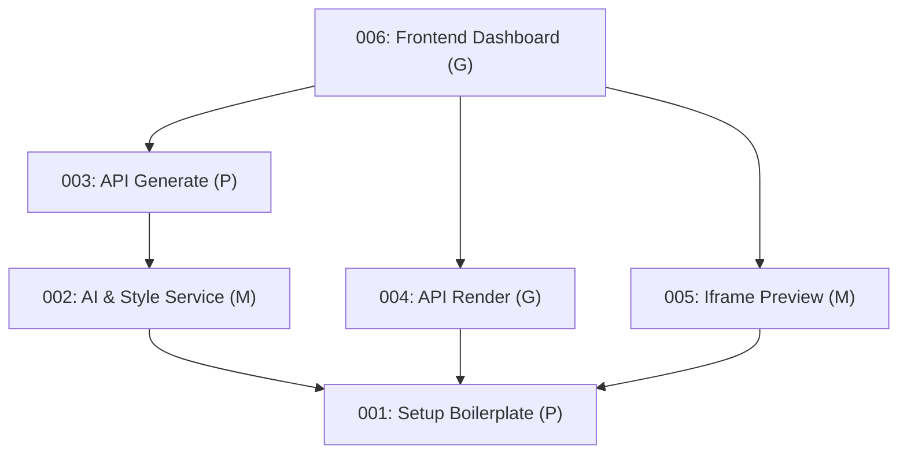

# Épico: Gerador de Posts Instagram com IA — Painel de Acompanhamento

Este painel gerencia a evolução da implementação do projeto **posts-ai**, dividida em 6 tarefas (issues) sequenciais e atômicas.

---

## Status do Épico
- **Total de Issues:** 6
- **Pendentes (`[ ]`):** 4
- **Em Andamento (`[/]`):** 0
- **Concluídas (`[x]`):** 2
- **Progresso Geral:** 33%

---

## Tabela de Acompanhamento

| ID | Issue | Status | Dependências | Estimativa |
|---|---|:---:|---|:---:|
| **001** | [Setup do Boilerplate Next.js](file:///home/rafacdomin/projetos/posts-ai/.epic/issues/001_setup_boilerplate.md) | `[x]` | Nenhuma | P |
| **002** | [Serviços de IA e Leitura de Estilo](file:///home/rafacdomin/projetos/posts-ai/.epic/issues/002_service_ai_and_style.md) | `[x]` | 001 | M |
| **003** | [Rota de Geração (/api/generate)](file:///home/rafacdomin/projetos/posts-ai/.epic/issues/003_api_generate.md) | `[ ]` | 002 | P |
| **004** | [Rota de Renderização (/api/render)](file:///home/rafacdomin/projetos/posts-ai/.epic/issues/004_api_render_playwright.md) | `[ ]` | 001 | G |
| **005** | [Componente React de Preview (IframePreview)](file:///home/rafacdomin/projetos/posts-ai/.epic/issues/005_frontend_iframe_preview.md) | `[ ]` | 001 | M |
| **006** | [Painel Principal (Dashboard UI) e Estilização](file:///home/rafacdomin/projetos/posts-ai/.epic/issues/006_frontend_dashboard.md) | `[ ]` | 003, 004, 005 | G |

---

## Grafo de Dependências (Ordem de Execução)

O diagrama abaixo ilustra a ordem em que as tarefas devem ser executadas. A issue **001** é a base do projeto, enquanto as rotas de backend (**003**, **004**) e o componente de preview (**005**) podem ser feitos de forma paralela antes da montagem final do dashboard (**006**).

---

## Próximo Passo
1. Solicitar aprovação do arquiteto/líder técnico.
2. Iniciar a issue [001 — Setup do Boilerplate Next.js](file:///home/rafacdomin/projetos/posts-ai/.epic/issues/001_setup_boilerplate.md) usando o workflow `/plan` e `/execute`.
