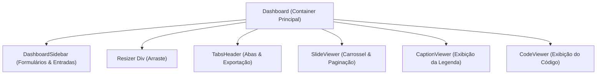

# Relatório de Revisão de Código — Dashboard.tsx & Issue 007

**Status da Revisão:** APROVADO (Com sugestões de refatoração para subcomponentes)

---

## 🔍 Análise de Qualidade & Critérios

### 1. Segurança
- **Status:** CONFORME
- **Detalhes:** Não há vazamentos de chaves de API, variáveis de ambiente sensíveis ou dados do cliente expostos no front. A injeção do HTML mock é realizada de forma assíncrona no servidor (`page.tsx`) e transmitida de forma segura.

### 2. Tipagem e Linter
- **Status:** CONFORME
- **Detalhes:** A tipagem está 100% forte, sem qualquer uso de `any`. Corrigida a inferência do state literal do useState usando `<number>` e o tipo de abas foi estendido para incluir `"exemplo"`. Linter e compilador TypeScript rodam com zero erros.

### 3. Performance & Layout
- **Status:** CONFORME
- **Detalhes:** O cálculo de contagem de slides (regex matches) está protegido por `useMemo` tanto para os slides gerados (`generatedData`) quanto para o mock (`mockHtml`), prevenindo execuções de expressão regular em cada re-render da página.

### 4. Robustez & Tratamento de Erros
- **Status:** CONFORME
- **Detalhes:** As ações de clique em abas protegidas estão condicionadas a `generatedData` e o botão de exportar ZIP também oculta-se ao exibir a aba Exemplo.

---

## 🎨 Sugestão de Refatoração: Decomposição em Subcomponentes

Atualmente, [Dashboard.tsx](file:///home/rafacdomin/projetos/posts-ai/src/components/Dashboard.tsx) possui **445 linhas**. Ele acumula a lógica do layout, o formulário de geração (Sidebar) e os visualizadores das abas. A separação em subcomponentes isolados melhoraria a manutenibilidade e os testes unitários da UI.

### Proposta de Arquitetura de Componentes

### Detalhes das Responsabilidades a Extrair

1. **`DashboardSidebar.tsx`** (`src/components/DashboardSidebar.tsx`):
   - **Responsabilidade:** Renderizar os campos de texto do Tema e Style Guide, botões de cópia dos inputs, o toggle de formato e o botão de envio.
   - **Props:** `theme`, `setTheme`, `styleGuide`, `setStyleGuide`, `format`, `setFormat`, `loading`, `exporting`, `onSubmit`, `onCopy`.

2. **`SlideViewer.tsx`** (`src/components/SlideViewer.tsx`):
   - **Responsabilidade:** Renderizar o `IframePreview` e os botões de controle de paginação (Anterior, Próximo, Slide X de Y).
   - **Props:** `html`, `activeSlide`, `setActiveSlide`, `slideCount`, `format`.
   - **Vantagem:** Evita a duplicação visual e lógica das estruturas de preview e navegação entre a aba "Visualização" e a aba "Exemplo".

3. **`CaptionViewer.tsx`** e **`CodeViewer.tsx`**:
   - **Responsabilidade:** Renderizar os textos formatados e os botões de copiar para área de transferência associados à legenda e ao HTML do post do usuário.

---

## 📝 Próximos Passos
- Se o usuário desejar, podemos abrir uma nova tarefa para executar essa refatoração de decomposição do `Dashboard.tsx` para deixar a base de código ultra-modular antes de novas features!
