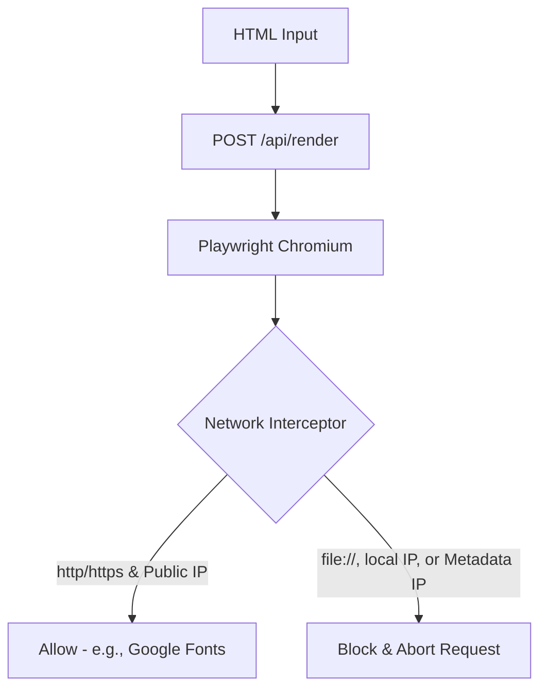

# Posts AI — Instagram Carousel Generator

### ⚡ Quick Summary
**Posts AI** is a high-fidelity Next.js application that leverages LLMs (via OpenRouter) to generate Instagram carousels and accompanying captions. From a simple topic and a markdown design guide, the app generates custom HTML/CSS slides, displays them in a real-time scaled preview, and renders them into high-resolution PNG images packaged in a `.zip` file using server-side Playwright.

---

## 🎨 System Highlights

* **AI-Generated HTML/CSS Layouts**: Generates customized slide designs based on local or custom brand identity guidelines.
* **Auto-Healing LLM Output Parser**: Implements robust JSON sanitization and automatic token-truncation repair algorithms to prevent parse failures.
* **Real-time Responsive Iframe Preview**: Renders generated slides in a dynamic `<iframe>` using CSS scale transformations for accurate mobile & desktop views without modifying slide proportions.
* **Headless Browser PNG Renderer**: Uses Playwright Chromium on the backend to screenshot slides at exact native resolutions (Feed: 1080x1350, Stories: 1080x1920).
* **Enterprise Security Standards**: Implements strict sandbox arguments and a network request interceptor to prevent Server-Side Request Forgery (SSRF) and Local File Inclusion (LFI).

---

## 🏗️ Architecture Overview

The codebase is built on **Clean Architecture** and SOLID principles to separate concerns, making it highly modular and testable:

```
posts-ai/
├── identidade/             # Default markdown design guidelines
├── src/
│   ├── app/
│   │   ├── api/            # Backend routes (/generate, /render)
│   │   └── globals.css     # Global premium dark-theme stylesheet
│   ├── components/         # Pure visual and layout React components
│   ├── services/           # External API & File system adapters (AI, Identity Guide)
│   ├── hooks/              # Isolated stateful UI logic (useClipboard, useResizableSidebar)
│   ├── constants/          # Centralized configuration tokens (Dimensions, Timeouts)
│   └── types/              # Unified TypeScript definitions
```

### 🧩 Core Patterns & Design Decisions

#### 1. Service Decoupling & Adapter Pattern
The application uses an `AIService` interface to abstract the LLM generation layer:
* **`OpenRouterAIService`**: Connects securely to the OpenRouter API with customized system prompts and abort-controller timeouts.
* **`MockAIService`**: Provides locally cached, design-compliant responses. This allows rapid frontend development and offline test coverage without incurring API costs.

#### 2. Stateful Logic Extraction (Hooks)
All interaction-heavy frontend logic is extracted into custom hooks (e.g., `useResizableSidebar` for drag-to-resize control, and `useClipboard` for timed clipboard visual indicators), keeping components readable and focused on rendering.

#### 3. Strict Constant Management
Physical dimensions, viewport constraints, and payload limitations are declared as read-only constants (`as const`) in `src/constants/index.ts` to ensure strict single-source-of-truth alignment across backend rendering and frontend scaling.

---

## 🛡️ Security Engineering (Headless Browser Sandboxing)

Capturing screenshots of arbitrary HTML generated by an AI or supplied by users is a classic attack vector for Server-Side Request Forgery (SSRF) and Local File Inclusion (LFI). To mitigate this, our Playwright engine implements advanced security controls:



* **Process Isolation:** The browser is launched with flags to disable GPU rendering, local file access (`--disable-local-file-access`), and shell execution environments.
* **Outbound Request Filtering:** A Playwright network router intercepts all requests and aborts:
  * Non-web protocols (e.g., blocking `file://`, `data://` network calls).
  * Private network IPs (RFC 1918) like `10.0.0.0/8`, `172.16.0.0/12`, and `192.168.0.0/16`.
  * Local host loopbacks (`127.0.0.1`, `localhost`, `[::1]`).
  * Cloud instance metadata endpoint (`169.254.169.254`), preventing IAM credential leakage.

---

## 🧪 Testing & Code Quality

* **TypeScript**: Strict type check configurations, avoiding `any` completely.
* **ESLint**: Configured to enforce clean imports and code style. Runs with 0 errors/warnings.
* **Vitest**: 13 unit tests verifying utilities, JSON recovery rules, hooks, and filesystem readers.

Run linting and test suites:
```bash
npm run lint
npm run test
```

---

## 🚀 Getting Started

### Prerequisites
* Node.js 18+
* Package manager (NPM or Yarn)

### 1. Installation
Clone the repository, install dependencies, and install the headless Chromium binary:
```bash
npm install
# Note: Playwright binaries are automatically set up post-install
```

### 2. Configure Environment Variables
Create a `.env.local` file in the root directory:
```env
# Change to "false" to use OpenRouter API
NEXT_PUBLIC_USE_MOCK=true

# OpenRouter Configuration (Required if NEXT_PUBLIC_USE_MOCK is false)
OPENROUTER_API_KEY=your_api_key_here
DEFAULT_AI_MODEL=anthropic/claude-3.5-sonnet
```

### 3. Run Development Server
```bash
npm run dev
```
Open [http://localhost:3000](http://localhost:3000) with your browser.

---

## 📈 Production & Scaling Strategy

If scaling this application for a high-traffic production environment, we propose:
1. **Externalize Playwright (Serverless Rendering):** Since Chromium binaries are too heavy for serverless hosting limitations (such as Vercel's 50MB function zip limit) and consume high memory, connect Playwright to a scalable containerized grid (like AWS ECS Fargate or Cloud Run) or a managed provider (like **browserless.io**).
2. **API Rate Limiting:** Implement IP-based rate limiting (e.g., using Redis) on the `/api/generate` endpoint to manage LLM API costs.
3. **Image Caching & Storage:** Upload generated PNGs to an object storage bucket (e.g., AWS S3) and serve them via CDN, ensuring we don't re-render identical slides.
