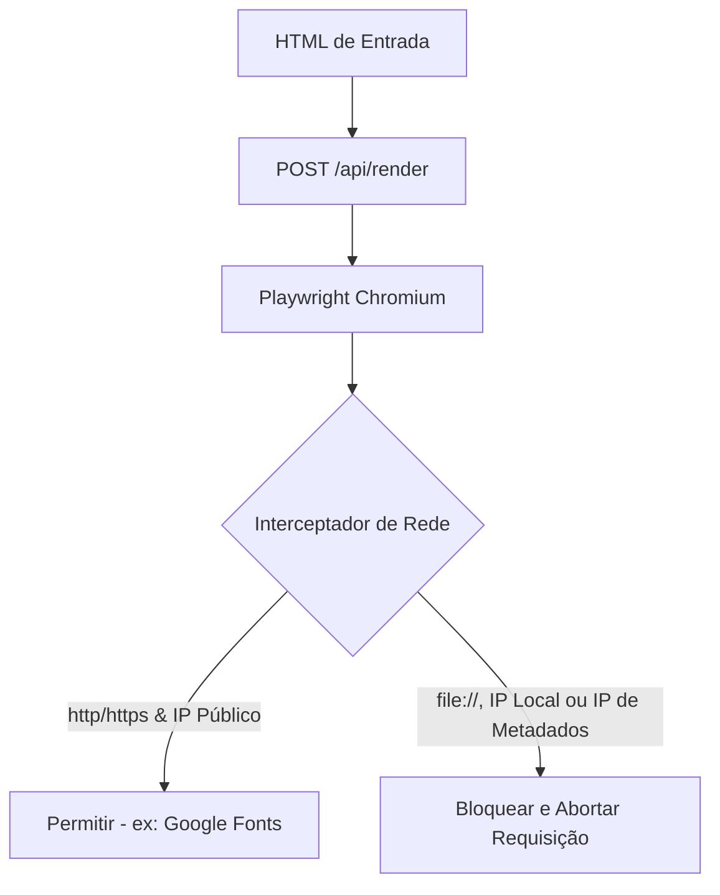

# Posts AI — Gerador de Carrosséis para Instagram com IA

### ⚡ Resumo Simples
O **Posts AI** é uma aplicação Next.js de alta fidelidade que utiliza modelos de linguagem (via OpenRouter) para gerar carrosséis de imagens e legendas para o Instagram. A partir de um tema e de um manual de identidade visual em markdown, a aplicação gera slides customizados em HTML/CSS, exibe um preview interativo e escalável em tempo real no navegador, e realiza a renderização das imagens em alta definição (PNG) empacotadas em um arquivo `.zip` através do Playwright rodando no backend.

---

## 🎨 Destaques do Sistema

* **Layouts HTML/CSS Gerados por IA**: Criação de designs dinâmicos de slides que leem regras locais ou customizadas de marcas (cores, fontes, contrastes).
* **Parser de IA Autoreparável**: Filtro sanitizador de caracteres de controle e algoritmo corretor de JSON truncado (caso a IA corte a resposta pelo limite de tokens), garantindo robustez de parse.
* **Preview Responsivo em Tempo Real**: Roda os slides gerados dentro de um `<iframe>` utilizando escalas de matriz CSS para manter fidelidade visual exata sem quebrar proporções.
* **Renderizador Playwright no Servidor**: Captura imagens de cada slide com resoluções nativas de publicação (Feed: 1080x1350, Stories: 1080x1920).
* **Segurança de Nível Corporativo**: Sandbox estrito do navegador e interceptação seletiva de tráfego de rede para mitigar ataques de SSRF (Server-Side Request Forgery) e LFI (Local File Inclusion).

---

## 🏗️ Arquitetura do Projeto

A estrutura de pastas reflete os padrões da **Clean Architecture** e princípios SOLID, mantendo responsabilidades e camadas bem desacopladas:

```
posts-ai/
├── identidade/             # Manual de estilo padrão em markdown
├── src/
│   ├── app/
│   │   ├── api/            # Endpoints backend (/generate, /render)
│   │   └── globals.css     # Estilização global do painel (Tema escuro premium)
│   ├── components/         # Componentes React visuais e estruturais
│   ├── services/           # Adaptadores externos de IA e leitura de arquivos locais
│   ├── hooks/              # Lógica comportamental e de estados isolada de UI
│   ├── constants/          # Definições de tokens e constantes globais (Tamanhos, timeouts)
│   └── types/              # Definições de tipos TypeScript unificados
```

### 🧩 Decisões Técnicas & Design Patterns

#### 1. Desacoplamento de Serviços (Adapter Pattern)
A comunicação com a inteligência artificial é abstraída pela interface `AIService`:
* **`OpenRouterAIService`**: Faz requisições HTTP seguras ao OpenRouter, com tratamento de limite de tempo (timeout via abort-controllers).
* **`MockAIService`**: Carrega mocks em conformidade estética salvos em arquivos locais. Permite desenvolvimento ágil de interface e execução de testes automatizados sem consumir tokens da API.

#### 2. Extração de Comportamento para Hooks Customizados
As complexidades de UI do frontend (como arrastar para redimensionar a sidebar em `useResizableSidebar` e controle visual temporário de cópia em `useClipboard`) são delegadas para hooks reutilizáveis, mantendo componentes puros e legíveis.

#### 3. Gestão Centralizada de Constantes
As proporções físicas dos posts, limites de requisições e timeouts não possuem "valores mágicos" espalhados; tudo é mantido como leitura estrita (`as const`) em `src/constants/index.ts`.

---

## 🛡️ Engenharia de Segurança (Sandboxing de Navegadores Headless)

Renderizar HTML arbitrário gerado por IA ou modificado no cliente em servidores de produção é um vetor clássico para vulnerabilidades de LFI (*Local File Inclusion*) e SSRF (*Server-Side Request Forgery*). Mitigamos isso no Playwright com:



* **Isolamento de Processo:** O Chromium é configurado com argumentos que desabilitam aceleração de hardware, acesso a arquivos locais (`--disable-local-file-access`) e sandboxes de execução do sistema.
* **Filtro de Requisições de Rede (Firewall Interno):** Criamos um roteador na instância do Playwright que analisa todas as requisições web feitas pelas fontes do slide e aborta:
  * Protocolos não-web (ex: tentativas de carregar `file://`, `data://` no servidor).
  * Intervalos de IPs de redes internas (RFC 1918), impedindo escaneamento de portas internas (`10.0.0.0/8`, `172.16.0.0/12`, `192.168.0.0/16`).
  * Conexões loopback do próprio servidor (`localhost`, `127.0.0.1`, `[::1]`).
  * O endpoint de metadados de provedores de nuvem (`169.254.169.254`), prevenindo vazamento de credenciais temporárias de IAM em plataformas AWS, GCP ou Azure.

---

## 🧪 Qualidade de Código & Testes

* **TypeScript**: Strict mode ativado em sua totalidade, sem uso do tipo genérico `any`.
* **ESLint**: Configuração rigorosa para manter conformidade estrutural. Executa com 0 erros/warnings.
* **Vitest**: 13 testes unitários validando hooks de interface, tratamento e reparo de JSON truncado da IA e serviços locais.

Execute os testes e o linter localmente:
```bash
npm run lint
npm run test
```

---

## 🚀 Como Executar

### Pré-requisitos
* Node.js 18 ou superior
* Gerenciador de pacotes NPM (ou equivalente)

### 1. Instalação das Dependências
Clone o repositório, instale as dependências e o Playwright:
```bash
npm install
# Nota: Os binários do Playwright são configurados automaticamente no postinstall
```

### 2. Configurar Variáveis de Ambiente
Crie um arquivo `.env.local` na raiz:
```env
# Altere para "false" para consumir a API real do OpenRouter
NEXT_PUBLIC_USE_MOCK=true

# Configuração do OpenRouter (Necessário apenas se NEXT_PUBLIC_USE_MOCK for false)
OPENROUTER_API_KEY=sua_chave_de_api_aqui
DEFAULT_AI_MODEL=anthropic/claude-3.5-sonnet
```

### 3. Rodar o Servidor de Desenvolvimento
```bash
npm run dev
```
Acesse [http://localhost:3000](http://localhost:3000) no seu navegador.

---

## 📈 Estratégia de Escala e Produção

Estas são as diretrizes de escalabilidade de infraestrutura preparadas:
1. **Desacoplamento do Playwright (Serverless):** Executar navegadores headless localmente consome muita memória (~150MB por instância) e o tamanho do Chromium ultrapassa o limite de empacotamento em ambientes serverless tradicionais (como Vercel de 50MB). Em produção, conectamos o Playwright a um pool distribuído de containers (AWS ECS Fargate, Cloud Run) ou a um provedor gerenciado como **browserless.io**.
2. **Rate Limiting de Custos:** Aplicação de limites de requisições por IP (*rate limit* com Redis) na API de geração para proteger a cota financeira do LLM.
3. **Cache de Mídia:** Armazenamento das imagens geradas em buckets S3 (AWS) com CDN à frente, evitando que o backend processe renderizações para requisições idênticas.
